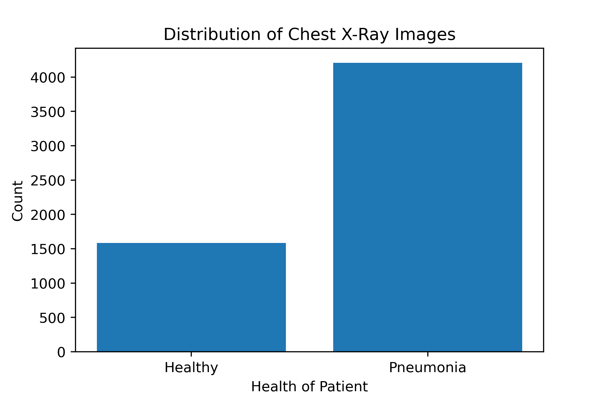
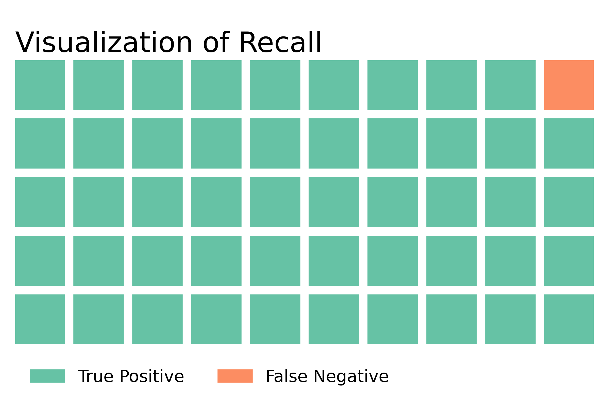

# X-ray Image Classification for Pneumonia

![Pneumonia_Worldwide]

## Overview 
Pneumonia is an infection in one or both lungs which makes people have difficulty breathing. It can be a medical emergency, especially among high-risk groups like people over 65 and children 5 or younger, whose immune systems are relatively weaker. Therefore, it is crucial to identify pneumonia in a more efficient and accurate way, so that we can have treatment in the early stage.
## Business Problem
According to the World Health Organization, there are 156 million cases of pneumonia each year in children younger than five years. It is a serious illness, especially in young children whose immune systems have not fully developed yet.

Pneumonia continues to be one of the leading causes of death among children across the globe. The death rates for pneumonia are highest in South Asia and sub-Saharan Africa. According to Unicef, almost 800,000 children died in 2019 from pneumonia, and pneumonia accounts for 14% of all deaths among children 5 years and younger. Given these sobering statistics, it is vital that doctors can quickly identify those with pneumonia to treat it as soon as possible. As the WHO explains, “effective diagnosis and treatment of pneumonia is critical to improve child survival.”

"The deaths in just 5 countries — India, Nigeria, Pakistan, the Democratic Republic of Congo, and Ethiopia – accounted for more than half of all deaths from childhood pneumonia in 2019." (https://ourworldindata.org/pneumonia)

To make the diagnosis process more efficient and accurate, we're going to build a machine learning model that can identify whether the input X-ray image is pneumonia or not. Once we have our model, we will cooperate with the WHO to deploy our model in areas around the world that need this help the most.

## Data Understanding 
For this project, we worked with 6000 chest X-ray images of pediatric patients from one to five years old found from ["Kaggle"](https://www.kaggle.com/datasets/paultimothymooney/chest-xray-pneumonia). This data was collected from the Guangzhou Women and Children's Medical Center in Guangzhou, China. The data has already been split into training, validation and testing sets, but the validation set was extremely small (8 images), so we combined all images into one folder and performed our own train, validation, test split. Approximately 75% of the images in our dataset belonged to those with pneumonia. Given that our dataset is images, there was very little data cleaning to perform, and we were able to jump straight into creating our neural network for classification of chest x-ray images. 

## Modeling and Results
In this project, we're trying to identify whether the input image is pneumonia or not. We built several Convolutional Neural Network (CNN) models to make the classification. We trained our model with training data and validated our models using validation data. Then based on the validation score, we choose our best model and ran that best model with testing data to get our final result. We built 12 CNN models in this project and among all the models, our 7th CNN had the best training and validation score when looking at accuracy and recall. So we used this model as our best model and ran the test using testing data. Our best model achieved 95.2 % accuracy and 98.1% recall on unseen test data. This recall score means that for every 50 X-Ray images belonging to patients with pneumonia, our model only misclassifies one of these images, which is very good. 

## Conclusion & Next Steps
In conclusion, our best model did very well at identifying the pneumonia images with 95.7 % accuracy and 97.3% recall. We care most about the recall score because this represents how well our model does at predicting the class of images belonging to those with pneumonia. Given our business case, false negatives (patient has pneumonia but we classify them as healthy) are much more dangerous than false positives (patient is healthy but we classify them as having pneumonia).

As for some potential next steps, we can work with the WHO to deploy our model in the real world, specifically in areas hardest hit by pneumonia among young children. Meanwhile, we can keep tuning our model based on the feedback in order to improve our recall. Plus, there are many pre-trained neural network models already available online, so we can run our data on those models and make some improvements to our model by comparing our model with those pre-trained models. Lastly, we don't have strong background knowledge on identifying Pneumonia from an X-Ray image, so it is necessary to tackle this issue with domain experts and consult them on questions such as, what features in an X-Ray image that our model misclassified could a radiologist point out to modify our model.

## For More Information

See the full analysis in the [Jupyter Notebook](modeling_notebook.ipynb) or review [this presentation](presentation.pdf).

For additional info, contact Ogo Ndugba, Yue Yu, or Zach Pollatsek as follows:

- Ogo:     ogo.ndugba@gmail.com
- Yue:     yuyue772@gmail.com
- Zach:    zacharypollatsek@gmail.com

## Repository Contents
- images/
- Data/
- WorkingNotebooks/
- models/
- .gitignore
- LICENSE.md
- modeling_notebook.ipynb
- README.md
